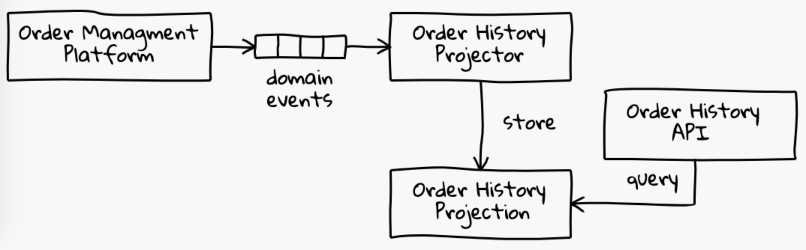
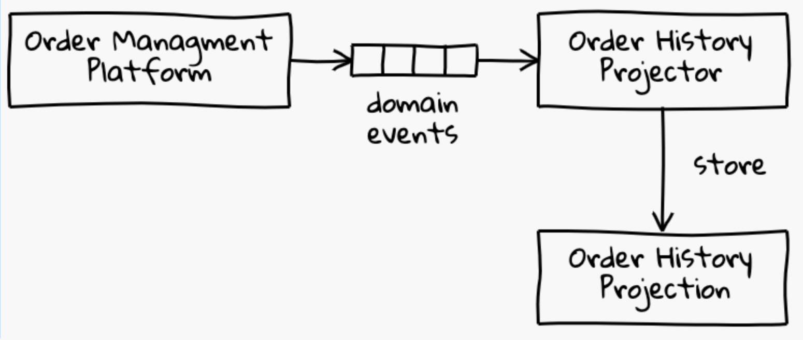
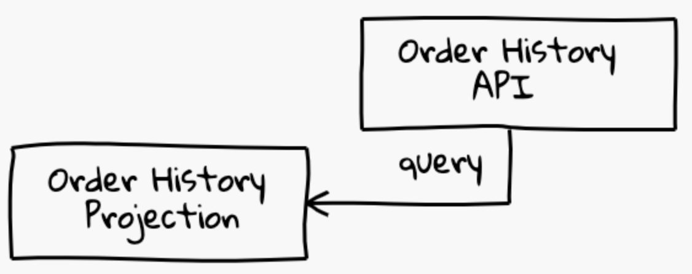

autoscale: true
header: #FF6B6B
footer-style: #C44D58
text: #4ECDC4
text-emphasis: #FFFFFF
text-strong: #C7F464
header-emphasis: #C44D58
header-strong: #C44D58

## (Im)pratical Functional Programming

### _Adopting Functional Programming_
### _In industry_

---

# Who am I

## _@al333z_
### Software Engineer
### Member of FP in Bologna 
### Runner


---

# Why this talk?

### _How many times have you heard:_
- FP is _too hard_
- FP is _not pragmatic_
- FP is not suited __to deliver value to the business__

---

# Why Functional Programming?

Why not.

---

# Why Functional Programming?

- Built on __solid foundations__, but there's no need to be a mathematician to be a functional programmer!
- Offers __abstractions and tecniques__ to solve concrete problems
- Improves code reuse, through __composition__
- Let us build programs which are **_simpler to reason about_**

---

# Why Developers are scared by Functional Programming?

- the *learning curve* may be steep 
- willingness to experience a _mental shift_
- may not appear _familiar_ at first
- I just don't know..

---

# Agenda

- A sample architecture
- Design architecture components
- Have some fun in the meanwhile?

---

# Sample Architecture: _Order History Service_



- Let's assume we are provided with domain events from an Order Managment Platform (e.g. OrderCreated), via a RabbitMQ broker
- We need to build an Order History Service

^ Talk ONLY about REQUIREMENTS!

---

# Order History Service: _components_


- a component which projects a model, in a MongoDB collection
- a simple HTTP service, which queries the collection returning orders

^ Talk ONLY about COMPONENTS!

---

# Disclaimer

Our focus here is **_NOT_** on the System Architecture

We'll just put our attention on _implementing architecture components_ using Pure Functional Programming, in Scala

---

# Why Scala

---

# Why Scala

## _I know Scala_

---

# Why Scala

- immutability, _ADTs_
- higher-kinded types + implicits -> *typeclasses*
- DSL-friendly
- discourages runtime checks (reflections, etc..)
- __mature ecosystem__ of FP libs (cats, cats-effects, fs2, circe, http4s, etc..)

---
# Let's start
---

# Building a projector



- __Consume__ a stream of events from a RabbitMQ queue
- __Persist__ a model to a MongoDB collection

---

# Projector application
1. read a bunch of configs from the env
2. interact with a RabbitMQ broker
2.1 open a connection
2.2 receive a Stream of events from the given queue
3. interact with a MongoDB cluster
3.1 open a connection
3.2 store the model to the given collection

---

# Can FP help us with **I/O** operations?

---

# Introducing IO

A data type for **encoding effects** as pure values, capable of expressing both computations such that:
- can end in *either success or failure*
- on evaluation *yield exactly one result*
- may support *cancellation*
 
---

# Introducing IO

A value of type `IO[A]` is a computation that, when evaluated, can perform __effects__ before returning a value of type `A`. 

---

# IO values

- are *pure* and *immutable*
- represents just a description of a *side effectful computation*
- are not evaluated (_suspended_) until the **end of the world**

---

# IO and combinators

```scala
object IO {
  def delay[A](a: => A): IO[A]
  def async[A](k: (Either[Throwable, A] => Unit) => Unit): IO[A]
  def pure[A](a: A): IO[A]
  def raiseError[A](e: Throwable): IO[A]
  def sleep(duration: FiniteDuration): IO[Unit] 
  ...
}

class IO[A] {
  def map[B](f: A => B): IO[B]
  def flatMap[B](f: A => IO[B]): IO[B]
  def *>[B](fb: IO[B]): IO[B]
  ...
}
```

---

[.code-highlight: none]
[.code-highlight: 1]
[.code-highlight: all]

# Composing sequential effects

```scala
val ioInt: IO[Int] = IO.delay{ println("hey!"); 1 }

val program: IO[Unit] =
 for {
    i1 <- ioInt
    _  <- IO.sleep(i.second)
    _  <- IO.raiseError(new RuntimeException("boom!"))
    i2 <- ioInt // not executed, comps is short-circuted
 } yield ()
```

[.code-highlight: none]
[.code-highlight: all]
```
Output:
hey
RuntimeException: boom!
```
---

# Putting things in practice!

---

[.code-highlight: 2-3]
[.code-highlight: 7,13]
[.code-highlight: all]

# 1. Read a bunch of configs from the env

```scala
object Mongo {
  case class Auth(username: String, password: String)
  case class Config(auth: Option[Auth], addresses: List[String], /*...*/)
  
  object Config {
    // a delayed computation which read from env variables
    val load: IO[Config] = IO.delay {     
      val user     = Option(System.getenv("MONGO_USERNAME"))
      val password = Option(System.getenv("MONGO_PASSWORD"))
      val auth = (user, password).mapN(Auth)
      //...reading other env vars ... //
      Config(auth, endpoints, port, db, collection)
    }
  }
}
```
---

# Composing effects

```scala
val ioOps = 
 for {
    mongoConfig  <- Mongo.Config.load
    rabbitConfig <- Rabbit.Config.load
    // TODO use configs to do something!
 } yield ()
```

^ Let's take a detour to talk about how this composed computation gets executed..

---
# How IO values are executed?

If IO values are just a description of _effectful computations_ which can be composed and so on... 

Who's gonna **_run_** the suspended computation then?

---

[.code-highlight: all]
[.code-highlight: 2]
[.code-highlight: all]

# *End of the world*

`IOApp` is a safe application type that describes a main which executes an `IO`, as the single _entry point_ to a **pure** program.

```scala
object OrderHistoryProjectorApp extends IOApp {
  override def run(args: List[String]): IO[ExitCode] =
    for {
      mongoConfig  <- Mongo.Config.load
      rabbitConfig <- Rabbit.Config.load
      // TODO use configs to start the main logic!
    } yield ExitCode.Success
}
```
^ `IOApp` provides an **_interpreter_** which will evaluate the `IO` value returned by the `run` method, dealing with all the dirty details of the JVM runtime, so _*you don't have to*_!

---

# Projector Application
1. ~~read a bunch of configs from the env~~
2. interact with a RabbitMQ broker
2.1 open a connection
2.2 receive a Stream of events from the given queue
3. interact with a MongoDB cluster
3.1 open a connection
3.2 store the model to the given collection

---

# 2. Interact with a RabbitMQ broker

Using `fs2-rabbit` lib which:
- provides a _purely functional api_
- let me introduce you a bunch of useful data types

---

# 2.1. Interact with a RabbitMQ broker
## Open a connection

```scala 
val client: Fs2Rabbit[IO] = Fs2Rabbit[IO](config)

val channel: Resource[IO, AMQPChannel] = client.createConnectionChannel
```

### What's a `Resource`?

---

# Introducing Resource

#### Effectfully allocates and releases a resource

---

# Extremely helpful to write code that:
- doesn't leak
- handles properly terminal signals

---

# Introducing Resource

```scala
object Resource {
  def make[A](
    acquire: IO[A])(
    release: A => IO[Unit]): Resource[A]
}

class Resource[A] {
  def use[B](f: A => IO[B]): IO[B]

  def map[B](f: A => B): Resource[B]
  def flatMap[B](f: A => Resource[B]): Resource[B]
  ...
}
```

[.footer: NB: not actual code, just a simplification sticking with IO type]
^ A note on the simplification

---
<!--

## Resource is polymorphic on its effect type

```scala
object Resource {
  def make[F[_], A](
    acquire: F[A])(
    release: A => F[Unit]): Resource[F, A]
}

class Resource[F[_], A] {
  def use[B](f: A => F[B]): F[B]

  def map[B](f: A => B): Resource[F, B]
  def flatMap[B](f: A => Resource[F, B]): Resource[F, B]
  ...
}
```
---
-->

[.code-highlight: 1]
[.code-highlight: 2-3]
[.code-highlight: 5-6]
[.code-highlight: 8]
[.code-highlight: all]


# Making a Resource

```scala
def mkResource(s: String): Resource[IO, String] = {
  val acquire = 
    IO.delay(println(s"Acquiring $s")) *> IO.pure(s)

  def release(s: String) = 
    IO.delay(println(s"Releasing $s"))

  Resource.make(acquire)(release)
}
```
---

# Using a Resource

```scala
val r: Resource[IO, (String, String)] = 
  for {
    outer <- mkResource("outer")
    inner <- mkResource("inner")
  } yield (outer, inner)

r.use { case (a, b) => IO.delay(println(s"Using $a and $b")) } // IO[Unit]
```

```
Output:
Acquiring outer
Acquiring inner
Using outer and inner
Releasing inner
Releasing outer
```

---

# Gotchas:
- _Nested resources_ are released in *reverse order* of acquisition 
- Outer resources are released even if an inner use or release fails
- Easy to _lift_ an `AutoClosable` to `Resource`, via `Resource.fromAutoclosable`
- You can _lift_ any `IO[A]` into a `Resource[IO, A]` with a no-op release via `Resource.liftF`

---

[.code-highlight: all]
[.code-highlight: 7]
[.code-highlight: 8]
[.code-highlight: 9-14]
[.code-highlight: 16]
[.code-highlight: all]

# 2.1. Interact with a RabbitMQ broker

```scala 
type Acker = AckResult => IO[Unit] 
type Consumer = Stream[IO, AmqpEnvelope[Try[OrderCreatedEvent]]]

val client: Fs2Rabbit[IO] = Fs2Rabbit[IO](config)

val rabbitDeps: Resource[IO, (Acker, Consumer)] = for {
  channel <- client.createConnectionChannel // resource opening a connection to a channel
  (acker, consumer) <- Resource.liftF( // lift an IO which creates the consumer
    client.createAckerConsumer[Try[OrderCreatedEvent]](
      queueName = QueueName("EventsFromOms"),
      basicQos = BasicQos(0, 10))(
      channel = channel,
      decoder = decoder
    )
  )
} yield (acker, consumer)
```

---

# I hear you...

```scala
type Consumer = 
  Stream[IO, AmqpEnvelope[Try[OrderCreatedEvent]]]
```

---

# Introducing Stream

---

# Introducing Stream

- Describes a *sequence* of effectful computation
- **_Pull-based_**,  a consumer pulls its values by repeatedly performing one pull step at a time
- **Simplify the way we write concurrent streaming consumers**

---

# Introducing Stream

A stream _producing output_ of type `O` and which may _evaluate `IO` effects_.

```scala
class Stream[O]{
  def evalMap[O2](f: O => IO[O2]): Stream[O2]
}
```

[.footer: NB: not actual code, just a simplification sticking with IO type]

--- 

// TODO something more on Stream

---

[.code-highlight: all]
[.code-highlight: 3,12]
[.code-highlight: 4-11]
[.code-highlight: all]

# Consuming a Stream

```scala 
class OrderHistoryProjector(consumer: Consumer, acker: Acker, logger: Logger) {
  val project: IO[Unit] =
    consumer.evalMap { envelope =>
      envelope.payload match {
        case Success(event) =>
          logger.info("Received: " + envelope) *>
            acker(AckResult.Ack(envelope.deliveryTag))
        case Failure(e) =>
          logger.error(e)("Error while decoding") *>
            acker(AckResult.NAck(envelope.deliveryTag))
      }
    }
     .compile.drain
}
```

---

# Projector application
1. ~~read a bunch of configs from the env~~
2. ~~interact with a RabbitMQ broker~~
2.1 ~~open a connection~~
2.2 ~~receive a Stream of events from the given queue~~
3. interact with a MongoDB cluster
3.1 open a connection
3.2 store the model to the given collection

---

# 3. Interact with a MongoDB cluster
Using the official `mongo-scala-driver`, which is *not* exposing purely functional apis..

---

# How to turn an API to be _functional<sup>TM</sup>_?

---

# How to turn an API to be _functional<sup>TM</sup>_?

In this case:
- **_wrap_** the impure type
- only **expose** the _safe_ version of its operations

---

# "Wrap the crap"

```scala
class Collection(
  private val wrapped: MongoCollection[Document]) {

  def insertOne(document: Document): IO[Unit] =
    wrapped
      .insertOne(document)
      .toIO // <- extension method converting to IO!
      .void
}
```

---

# 3.1 Open a connection

```scala
object Mongo {
  ...
 def collectionFrom(conf: Config): Resource[IO, Collection] = {
  val clientSettings = ??? // conf to mongo-scala-driver settings
  
  Resource
   .fromAutoCloseable(IO.defer(MongoClient(clientSettings)))
   .map { client => 
           val unsafeCol = client.getDatabase(conf.databaseName)
                                 .getCollection(conf.collectionName)
           new Collection(unsafeCol)
   }
 }
}
```
---

# Projector application
1. ~~read a bunch of configs from the env~~
2. ~~interact with a RabbitMQ broker~~
2.1 ~~open a connection~~
2.2 ~~receive a Stream of events from the given queue~~
3. interact with a MongoDB cluster
3.1 ~~open a connection~~
3.2 store the model to the given collection

---

[.code-highlight: all]
[.code-highlight: 8,15]
[.code-highlight: all]

# 3.2 Store the model to the given collection

```scala 
trait EventRepository {
  def store(event: OrderCreatedEvent): IO[Unit]
}

object EventRepository {
 def fromCollection(collection: Collection): EventRepository = new EventRepository {
   def store(event: OrderCreatedEvent): IO[Unit] =
     collection.insertOne( // using safe ops
       Document(
         "id"      -> event.id,
         "company" -> event.company,
         "email"   -> event.email,
         "lines" -> event.lines.map(line => ...)
       )
     )
  }
}
```

---

[.code-highlight: all]
[.code-highlight: 1]
[.code-highlight: 7]
[.code-highlight: all]

# 3.2 Store the model to the given collection

```scala
class OrderHistoryProjector(eventRepo: EventRepository,  consumer: Consumer,  acker: Acker,  logger: Logger) {
  val project: IO[Unit] =
    consumer.evalMap { envelope =>
      envelope.payload match {
        case Success(event) =>
          logger.info("Received: " + envelope) *>
            eventRepo.store(event) *>
              acker(AckResult.Ack(envelope.deliveryTag))
        case Failure(e) =>
          logger.error(e)("Error while decoding") *>
            acker(AckResult.NAck(envelope.deliveryTag))
      }
    }
     .compile.drain 
}
```

---

# Projector application
1. ~~read a bunch of configs from the env~~
2. ~~interact with a RabbitMQ broker~~
2.1 ~~open a connection~~
2.2 ~~receive a Stream of events from the given queue~~
3. ~~interact with a MongoDB cluster~~
3.1 ~~open a connection~~
3.2 ~~store the model to the given collection~~

---

# Wiring

How to achieve _dependency inversion_?

---

# Wiring

- *`Reader`*/*`Kleisli`*?
- *Cake pattern*?
- *Dagger* et similia?
- Your favourite *DI framework* with xmls and reflection?

---

# Wiring

## **_Constructor Injection_**!

- **I don't like _suffering_**
- JVM application lifecycle is not so complex
- `IO`, `SafeApp`, `Resource`, `Stream` are handling properly termination events

---

# Constructor Injection

### a class with a **private constructor** taking its dependencies as input

[.footer: My view of Constructor Injection for effectful applications]

---

# Constructor Injection

### a companion object 
  1. with a _`fromXXX`_ method (**smart constructor**) taking its config (or other useful params) as input
  2.  usually acquiring resources 
  3.  and returning the component as a _resource_ itself
 
[.footer: My view of Constructor Injection for effectful applications]

---

[.code-highlight: all]
[.code-highlight: 1]
[.code-highlight: 10-12]
[.code-highlight: all]

# Wiring - Constructor Injection

```scala
class OrderHistoryProjector private (
  eventRepo: EventRepository, 
  consumer: Consumer, 
  acker: Acker, 
  logger: Logger) {
  ...
}

object OrderHistoryProjector {
  def fromConfigs(mongoConfig: Mongo.Config,
                  rabbitConfig: Fs2RabbitConfig
  ): Resource[IO, OrderHistoryProjector] = ...
}
```

---

# Wiring - Constructor Injection

```scala
object OrderHistoryProjector {
  def fromConfigs(
    mongoConfig: Mongo.Config,
    rabbitConfig: Fs2RabbitConfig
  ): Resource[IO, OrderHistoryProjector] =
    for {
      collection        <- Mongo.collectionFrom(mongoConfig)
      logger            <- Resource.liftF(Slf4jLogger.create[IO])
      (acker, consumer) <- Rabbit.consumerFrom(
                            rabbitConfig,
                            eventDecoder)
      repo = EventRepository.fromCollection(collection)
    } yield new OrderHistoryProjector(repo, consumer, acker, logger)
}
```

---

# Wiring - Constructor Injection

- **No magic at all**, each dependency is explicitely passed in the *smart constructor* of each component
- Acquiring/releasing resources is handled as an *effect*

---

[.code-highlight: all]
[.code-highlight: 9-11]
[.code-highlight: all]

# Projector Application: Main

```scala
object OrderHistoryProjectorApp extends IOApp {

  def run(args: List[String]): IO[ExitCode] =
    for {
      // resolve configs from the environment
      mongoConfig  <- Mongo.Config.load
      rabbitConfig <- Rabbit.Config.load

      _ <- OrderHistoryProjector
            .fromConfigs(mongoConfig, rabbitConfig) // acquire the needed resources
            .use(_.project) // start to process the stream of events

    } yield ExitCode.Success
}
```

---

# End of part 1


---
# Sample Architecture: Order History Service


---

# Let's move to the other half..

---

# Building an HTTP api



---

# Order History API
1. read a bunch of configs from the env
2. interact with a MongoDB cluster
2.1 open a connection
2.2 read the model from the collection
3. expose a bunch of HTTP routes
3.1 define routes
3.2 implement each route, querying the projection

---

# You already know most of the things!

---

# You already know most of the things!

How to:
- handle effects with `IO`
- acquire/release `Resources`
- achieve _dependency inversion_, via constructor injection

---

# Building an HTTP api - Main

```scala
object OrderHistoryApp extends IOApp {
  def run(args: List[String]): IO[ExitCode] =
    for {
      mongoConfig <- Mongo.Config.load
      _ <- OrderHistory
            .fromConfig(mongoConfig)
            .use(_.serve)
    } yield ExitCode.Success
}
```

Looks familiar already...

---

# The plan
The api application should:
1. ~~read a bunch of configs from the env~~
2. interact with a MongoDB cluster
2.1 ~~open a connection~~
2.2 read the model from the collection
3. expose a bunch of HTTP routes
3.1 define routes
3.2 implement each route, querying the projection

---

# 2.2 Read the model from the collection

```scala
class Collection private (
 private val wrapped: MongoCollection[Document]) {
  ...
  def find(document: Document, 
           skip: Int, 
           limit: Int): Stream[IO, Document] =
    wrapped
      .find(document)
      .skip(skip)
      .limit(limit)
      .toPublisher
      .toStream[IO]()
}
```
- Wrapping `mongo-scala-driver` types, exposing `Stream` via extension methods (and reactive streams interoperation)
- The double conversion is probably not ideal, but easy enough to be presented here

---

# 2.2 Read the model from the collection
### Interface + smart constructor

```scala
trait OrderRepository {
  def findBy(email: Email, 
             company: Company): IO[List[Order]]
}

object OrderRepository {
  def fromCollection(
    collection: Collection): OrderRepository = ???
}
```
---
# 2.2 Read the model from the collection
### Implementation

```scala
def fromCollection(collection: Collection): OrderRepository = 
  new OrderRepository {
    def findBy(email: Email, company: Company): IO[List[Order]] = 
      collection
       .find(
         Document(
           "email"   -> email.value,
           "company" -> company.value
         )
       )
       .compile.toList // Stream[IO, Document] -> IO[List[Document]]
       .flatMap(_.traverse(doc => IO.fromTry(Order.fromBson(doc)))) // IO[List[Document]] -> IO[List[Order]]
  }
}
```
---

# The plan
The api application should:
1. ~~read a bunch of configs from the env~~
2. ~~interact with a MongoDB cluster~~
2.1 ~~open a connection~~
2.2 ~~read the model from the collection~~
3. expose a bunch of HTTP routes
3.1 define routes
3.2 implement each route, querying the projection

---

# 3. Expose a bunch of HTTP routes
Not reinventing the wheel, just using `http4s` lib

---

# Why http4s 
- convenient DSL
- integrates with `IO` and `Stream`
- supports cancellation
- integrates with many libs for serialization-deserialization (circe, scala-xml, etc..)

---

# 3.1 Define routes

## Route to match against
`GET /:company/orders?email={email}`

---

## Matching to value types

`GET /:company/orders?email={email}`

```scala
case class Company(value: String)

case class Email(value: String)
```

Match on path variables and query parameters, avoiding primitive types (`String`, `Int`, `Boolean`)

---

[.code-highlight: all]
[.code-highlight: 2]
[.code-highlight: all]

# Matching on _path variables_

Using _extractor objects_

```scala
object CompanyVar {
  def unapply(arg: String): Option[Company] = 
    if (arg != "") 
      Some(Company(arg))
    else 
      None
}
```

---

# Matching on _path variables_

Enabling __pattern matching__ toward value types

```scala
 def sample(s: String) = s match {
   case CompanyVar(x) => println("matched Company: " + x)
   case _             => println("not matched")
 }
 
 sample("matched: ACME") // Company(ACME)
 sample("")              // not matched
```

---

# Matching on _path variables_

```scala
object CompanyVar {
  def unapply(arg: String): Option[Company] = 
    if (arg != "") 
      Some(Company(arg))
    else 
      None
}
```

- can be _composed_ with other extractors
- in case of `None`, the route is not matched and the next one is tried

---

# Matching on query params

Also performing validations...

```scala
object Email {
 // incomplete..
 private def validate(x: String): Option[String] = """(\w+)@([\w\.]+)""".r.findFirstIn(x)
   
 val decoder: QueryParamDecoder[Email] = value =>
   validate(value.value)
   .map(Email(_))
   .toValidNel(ParseFailure("Invalid Email", value.value) 

 object EmailQueryParam extends QueryParamDecoderMatcher[Email]("email")(decoder)
}
```

- A bit tricky at first, but really poweful
- Returns a `BadRequest` in case the _validation fails_

---

# 3.1 Define routes

- `HttpRoutes` are constructed by **pattern matching** the request
- combining _path variables_ and _query param_ extractors!

```scala
HttpRoutes.of[IO] {
 case GET -> Root / CompanyVar(company) / "orders" :? EmailQueryParam(email) => ???
 case GET -> Root / "other"                                                  => ???
}
```

- will match `/ACME/orders?email=asd@sdf.com`
- will return 400 on `/ACME/orders?email=notanemail`
- will return 404 on `/foo`

---

# The plan
The api application should:
1. ~~read a bunch of configs from the env~~
2. ~~interact with a MongoDB cluster~~
2.1 ~~open a connection~~
2.2 ~~read the model from the collection~~
3. expose a bunch of HTTP routes
3.1 ~~define routes~~
3.2 implement each route, querying the projection

---

# http4s routes - explained

`HttpRoutes[IO]` is an alias for 
`Kleisli[OptionT[IO, ?], Request, Response]`
 
Which can be rewritten (more or less..) to 
`Request => IO[Option[Response]]`

The `orNotFound` extension method will handle the case whether the request won't match any route, returning a `404`

Our routes are now `Request => IO[Response]`

[.footer: NB: not 100% accurate, but close enough]

---

# 3.2 Implement each route, querying the projection

```scala
object OrderHistoryRoutes {
  def fromRepo(
   orderRepository: OrderRepository): HttpRoutes[IO] = 
     HttpRoutes.of[IO] {
       case GET -> Root / CompanyVar(company) / "orders" :? EmailQueryParam(email) =>
               orderRepository
                 .findBy(email, company)
                 .flatMap(res => Ok(res.asJson))
     }
} 
```

- smart constructor, _building routes_
- _returning_ `200` for the happy path

---

# The plan
The api application should:
1. ~~read a bunch of configs from the env~~
2. ~~interact with a MongoDB cluster~~
2.1 ~~open a connection~~
2.2 ~~read the model from the collection~~
3. ~~expose a bunch of HTTP routes~~
3.1 ~~define routes~~
3.2 ~~implement each route, querying the projection~~

---

# Setting up the server

```scala
class OrderHistory private (routes: HttpRoutes[IO]) {
  val serve: IO[Unit] =
    BlazeServerBuilder[IO]
     .bindHttp(80, "0.0.0.0")
     .withHttpApp(routes.orNotFound)
     .serve
     .compile.drain
}

object OrderHistory {
 def fromConfig(config: Mongo.Config): Resource[IO, OrderHistory] =
    Mongo
     .collectionFrom(mongoConfig)
     .map { collection =>
       val repo    = OrderRepository.fromCollection(collection)
       val service = OrderHistoryRoutes.fromRepo(repo)
       new OrderHistory(service)
     }
}
```
---

# Building an HTTP api - Main

```scala
object OrderHistoryApp extends IOApp {
  def run(args: List[String]): IO[ExitCode] =
    for {
      mongoConfig <- Mongo.Config.load

      _ <- OrderHistory
            .fromConfig(mongoConfig)
            .use(_.serve)

    } yield ExitCode.Success
}
```
---

# All done!

---

# Things I'm not telling you

---

# Things I'm not telling you
## _Typeclasses_

---

# Things I'm not telling you
## _Higher Kinded Types_

---

[.code-highlight: all]
[.code-highlight: 4]
[.code-highlight: all]

# Things I'm not telling you
## _Implicits dependencies_

- `fs2`, `fs2-rabbit` and `http4s` are _polymorphic_ in the effect type `F[_]`
- I only showed you its usage with `IO`..
- If you actually look at the code in the repo, you'll see something like:

```scala
object OrderHistory {
  def fromConfig(
   mongoConfig: Mongo.Config)(
   implicit ce: ContextShift[IO], ti: Timer[IO]
   ): Resource[IO, OrderHistory] =
} 
```
---

## Appendix: What does it mean polymorphic in the effect type `F[_]`?
- let's suppose you want to provide a _library_ which does some kind of IO operation (e.g. interacting with a DB)
- and there exist _multiple effect libraries_ in the ecosystem (e.g. cats-effect `IO`, monix `Task`, zio `ZIO`, etc..)
- cats-effect provides __a set of typeclasses__ which let us build IO libraries/applications __without committing to a specific IO implementation__!

---

# Things I'm not telling you
## Testing
###### _Nobody really needs mockito_

---

# Conclusions

- 2 production-ready components in under 600 LOC
- only _3 main datatypes_: `IO`, `Resource`, `Stream`
- no _variables_, no _mutable state_
- no fancy abstractions
- no unneeded polymorphism (e.g. tagless final)
- __I could have written almost the same code in Kotlin, Swift or.. Haskell!__

---

# Thanks

---

# References

https://github.com/AL333Z/fp-in-industry
https://typelevel.org/cats-effect/
https://fs2.io/
https://http4s.org/
https://fs2-rabbit.profunktor.dev/